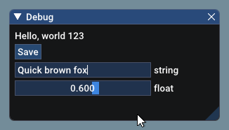
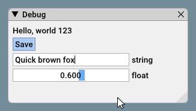
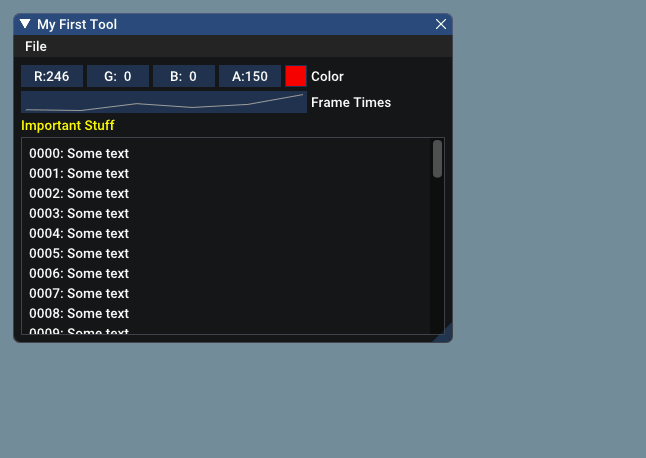

# Neslib.ImGui

Delphi wrapper for [Dear ImGui](https://github.com/ocornut/imgui).

<sub>(This library is available under a free and permissive license, but needs financial support to sustain its continued improvements. In addition to maintenance and stability there are many desirable features yet to be added. If your company is using Dear ImGui, please consider reaching out.)</sub>

Businesses: support continued development and maintenance via invoiced technical support, maintenance, sponsoring contracts:
 *E-mail: contact @ dearimgui dot com*
Individuals: support continued development and maintenance [here](https://www.paypal.com/cgi-bin/webscr?cmd=_s-xclick&hosted_button_id=WGHNC6MBFLZ2S). Also see [Sponsors](https://github.com/ocornut/imgui/wiki/Sponsors) page.

[TOC]

## The Pitch

Dear ImGui is a **bloat-free graphical user interface library**. It outputs optimized vertex buffers that you can render anytime in your 3D-pipeline-enabled application. It is fast, portable, renderer agnostic, and self-contained (no external dependencies).

Dear ImGui is designed to **enable fast iterations** and to **empower programmers** to create **content creation tools and visualization / debug tools** (as opposed to UI for the average end-user). It favors simplicity and productivity toward this goal and lacks certain features commonly found in more high-level libraries.

Dear ImGui is particularly suited to integration in game engines (for tooling), real-time 3D applications, fullscreen applications, embedded applications, or any applications on console platforms where operating system features are non-standard.

- Minimize state synchronization.
- Minimize state storage on user side.
- Minimize setup and maintenance.
- Easy to use to create dynamic UI which are the reflection of a dynamic data set.
- Easy to use to create code-driven and data-driven tools.
- Easy to use to create ad hoc short-lived tools and long-lived, more elaborate tools.
- Easy to hack and improve.
- Portable, minimize dependencies, run on target (consoles, phones, etc.).
- Efficient runtime and memory consumption.
- Battle-tested, used by many major actors in the game industry.

### Usage

After Dear ImGui is set up in your application, you can use it from _anywhere_ in your program loop:

```pascal
// One-time initialization:
var Text: TImGuiText = 'Quick brown fox;
var F: Single := 0.6;

// On every frame:
ImGui.Text(ImGui.Format('Hello, world %d', [123]));
if (ImGui.Button('Save')) then
  MySaveFunction();

ImGui.InputText('string', Text);
ImGui.SliderFloat('float', F, 0, 1);
```

Result:



Some notes:

* ImGui works mostly with C-style strings (UTF-8 encoded). For performance reasons, the Delphi wrapper also uses these string types (as `PUTF8Char`). This avoids continuous conversions from `UnicodeString` to `PUTF8Char` for every frame. But it *does* mean that you cannot use Delphi strings (although you can use string constants, as for the `ImGui.Button` in the example above). Should you need to use Delphi strings, then you can use helper functions like `ImGui.Format` and `ImGui.ToUtf8` (as shown in the `ImGui.Text` example above).
* The `ImGui` type is a (static) record and mimics the `ImGui` namespace in the original C++ version.
* Input controls, like `ImGui.InputText` and `ImGui.SliderFloat` have a var-parameter with the input value. Changing the value in the user interface immediately changes the value of variable accordingly (like the `Text` and `F` variables in the example above).

Code:

```pascal
// One-time initialization:
var MyToolActive := False;
var MyColor := TColor.Create(0.7, 0, 0, 1);

// On every frame:

// Create a window called "My First Tool", with a menu bar.
ImGui.Begin('My First Tool', @MyToolActive, [TImGuiWindowFlag.MenuBar]);
if (ImGui.BeginMenuBar) then
begin
  if (ImGui.BeginMenu('File')) then
  begin
    if (ImGui.MenuItem('Open..', 'Ctrl+O')) then
      { Do stuff };
      
    if (ImGui.MenuItem('Save', 'Ctrl+S')) then
      { Do stuff };
      
    if (ImGui.MenuItem('Close', 'Ctrl+W')) then
      MyToolActive := False;
      
    ImGui.EndMenu;
  end;  
  ImGui.EndMenuBar;
end;

// Edit a color
ImGui.ColorEdit4('Color', MyColor);

// Plot some values
const
  MY_VALUES: array [0..5] of Single = (0.2, 0.1, 1.0, 0.5, 0.9, 2.2);
  
ImGui.PlotLines('Frame Times', @MY_VALUES, Length(MY_VALUES));

// Display contents in a scrolling region
ImGui.TextColored(TColor.Create(1, 1, 0, 1), 'Important Stuff');
ImGui.BeginChild('Scrolling');
for var N := 0 to 49 do
  ImGui.Text(ImGui.Format('%4d: Some text', [N]));

ImGui.EndChild;
ImGui.End;
```

Result:

 

Dear ImGui allows you to **create elaborate tools** as well as very short-lived ones. Dear ImGui is not just for tweaking values. You can use it to trace a running algorithm by just emitting text commands. You can use it along with your own reflection data to browse your dataset live. You can use it to expose the internals of a subsystem in your engine, to create a logger, an inspection tool, a profiler, a debugger, an entire game-making editor/framework, etc.

### How it works

Check out the Wiki's [About the IMGUI paradigm](https://github.com/ocornut/imgui/wiki/About-the-IMGUI-paradigm) section if you want to understand the core principles behind the IMGUI paradigm. An IMGUI tries to minimize superfluous state duplication, state synchronization, and state retention from the user's point of view. It is less error-prone (less code and fewer bugs) than traditional retained-mode interfaces, and lends itself to creating dynamic user interfaces.

Dear ImGui outputs vertex buffers and command lists that you can easily render in your application. The number of draw calls and state changes required to render them is fairly small. Because Dear ImGui doesn't know or touch graphics state directly, you can call its functions anywhere in your code (e.g. in the middle of a running algorithm, or in the middle of your own rendering process). Refer to the sample applications in the examples/ folder for instructions on how to integrate Dear ImGui with your existing codebase.

*A common misunderstanding is to mistake immediate mode GUI for immediate mode rendering, which usually implies hammering your driver/GPU with a bunch of inefficient draw calls and state changes as the GUI functions are called. This is NOT what Dear ImGui does. Dear ImGui outputs vertex buffers and a small list of draw calls batches. It never touches your GPU directly. The draw call batches are decently optimal and you can render them later, in your app or even remotely.*

### Demo

Calling the `ImGui.ShowDemoWindow` method will create a demo window showcasing a variety of features and examples. [Here's how te demo look](https://raw.githubusercontent.com/wiki/ocornut/imgui/web/v167/v167-misc.png).

### Gallery

For more user-submitted screenshots of projects using Dear ImGui, check out the [Gallery Threads](https://github.com/ocornut/imgui/issues/5243)!

### Support, Frequently Asked Questions (FAQ)

See: [Frequently Asked Questions (FAQ)](https://github.com/ocornut/imgui/blob/master/docs/FAQ.md) where common questions are answered.

See: [Wiki](https://github.com/ocornut/imgui/wiki) for many links, references, articles.

See: [Articles about the IMGUI paradigm](https://github.com/ocornut/imgui/wiki#about-the-imgui-paradigm) to read/learn about the Immediate Mode GUI paradigm.

See: [Upcoming Changes](https://github.com/ocornut/imgui/wiki/Upcoming-Changes).

Credits

Developed by [Omar Cornut](https://www.miracleworld.net/) and every direct or indirect [contributors](https://github.com/ocornut/imgui/graphs/contributors) to the GitHub. The early version of this library was developed with the support of [Media Molecule](https://www.mediamolecule.com/) and first used internally on the game [Tearaway](https://tearaway.mediamolecule.com/) (PS Vita).

Recurring contributors (2022): Omar Cornut [@ocornut](https://github.com/ocornut), Rokas Kupstys [@rokups](https://github.com/rokups) (a large portion of work on automation systems, regression tests and other features are currently unpublished).

Sponsoring, support contracts and other B2B transactions are hosted and handled by [Lizardcube](https://www.lizardcube.com/).

Omar: "I first discovered the IMGUI paradigm at [Q-Games](https://www.q-games.com/) where Atman Binstock had dropped his own simple implementation in the codebase, which I spent quite some time improving and thinking about. It turned out that Atman was exposed to the concept directly by working with Casey. When I moved to Media Molecule I rewrote a new library trying to overcome the flaws and limitations of the first one I've worked with. It became this library and since then I have spent an unreasonable amount of time iterating and improving it."

Embeds [ProggyClean.ttf](http://upperbounds.net/) font by Tristan Grimmer (MIT license).
Embeds [stb_textedit.h, stb_truetype.h, stb_rect_pack.h](https://github.com/nothings/stb/) by Sean Barrett (public domain).

Inspiration, feedback, and testing for early versions: Casey Muratori, Atman Binstock, Mikko Mononen, Emmanuel Briney, Stefan Kamoda, Anton Mikhailov, Matt Willis. Also thank you to everyone posting feedback, questions and patches on GitHub.

## Documentation

### Mission Statement

- Easy to use to create code-driven and data-driven tools.
- Easy to use to create ad hoc short-lived tools and long-lived, more elaborate tools.
- Easy to hack and improve.
- Minimize setup and maintenance.
- Minimize state storage on user side.
- Minimize state synchronization.
- Portable, minimize dependencies, run on target (consoles, phones, etc.).
- Efficient runtime and memory consumption.

Designed for developers and content-creators, not the typical end-user! Some of the current weaknesses include:

- Doesn't look fancy, doesn't animate.
- Limited layout features, intricate layouts are typically crafted in code.

### End-User Guide

- Double-click on title bar to collapse window.
- Click upper right corner to close a window, available when `AOpen: PBoolean` is passed to `ImGui.Begin`.
- Click and drag on lower right corner to resize window (double-click to auto fit window to its contents).
- Click and drag on any empty space to move window.
- TAB/SHIFT+TAB to cycle through keyboard editable fields.
- CTRL+Click on a slider or drag box to input value as text.
- Use mouse wheel to scroll.
- Text editor:
   - Hold SHIFT or use mouse to select text.
   - CTRL+Left/Right to word jump.
   - CTRL+Shift+Left/Right to select words.
   - CTRL+A or Double-Click to select all.
   - CTRL+X,CTRL+C,CTRL+V to use OS clipboard/
   - CTRL+Z,CTRL+Y to undo/redo.
   - ESCAPE to revert text to its original value.
   - Controls are automatically adjusted for OSX to match standard OSX text editing operations.
- General Keyboard controls: enable with `TImGuiConfigFlag.NavEnableKeyboard`.
- General Gamepad controls: enable with `TImGuiConfigFlag.NavEnableGamepad`. Download [controller mapping PNG/PSD](http://dearimgui.org/controls_sheets).

### Programmer Guide

- Remember to check the wonderful [Wiki](https://github.com/ocornut/imgui/wiki) and the [Frequently Asked Questions](https://www.dearimgui.org/faq).
 - Your code creates the UI, if your code doesn't run the UI is gone! The UI can be highly dynamic, there are no construction or destruction steps, less superfluous data retention on your side, less state duplication, less state synchronization, fewer bugs.
 - Call and read `ImGui.ShowDemoWindow` for demo code demonstrating most features.
 - Dear ImGui is an implementation of the IMGUI paradigm (immediate-mode graphical user interface, a term coined by Casey Muratori). You can learn about IMGUI principles at http://www.johno.se/book/imgui.html, http://mollyrocket.com/861 & more links in Wiki.
 - Dear ImGui is a "single pass" rasterizing implementation of the IMGUI paradigm, aimed at ease of use and high-performances. For every application frame, your UI code will be called only once. This is in contrast to e.g. Unity's implementation of an IMGUI, where the UI code is called multiple times ("multiple passes") from a single entry point. There are pros and cons to both approaches.
 - Our origin is on the top-left. In axis aligned bounding boxes, Min = top-left, Max = bottom-right.